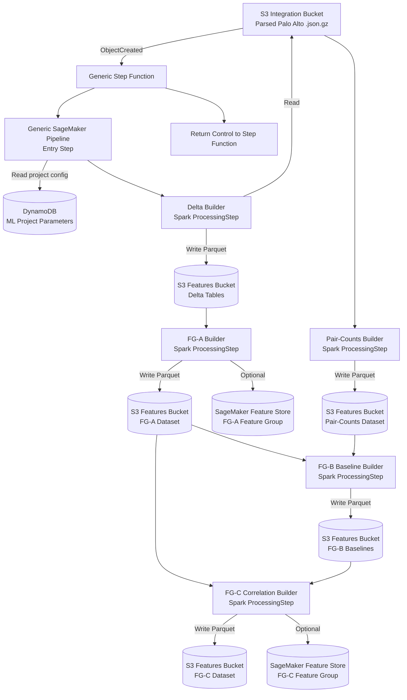

# NDR Feature Engineering Pipeline Flowchart

## Notes
- The **Step Function** is intended to be generic and reusable across ML projects.
- The **SageMaker Pipeline** resolves project/job configuration from DynamoDB (`ML_PROJECTS_PARAMETERS_TABLE_NAME`).
- Each processing step reads/writes through S3, allowing retries and batch reprocessing.
