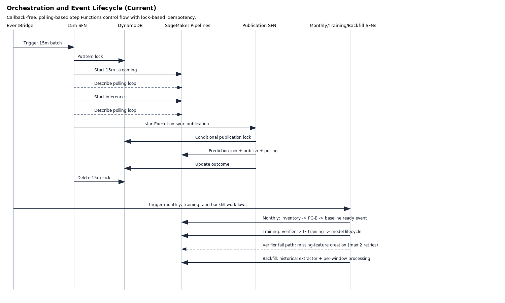
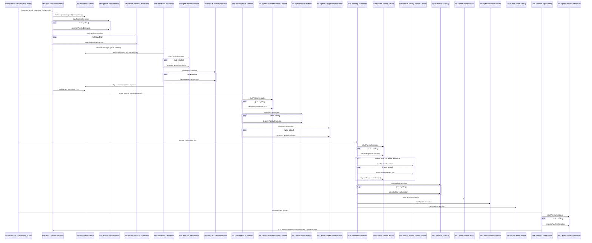

# Orchestration and Event Lifecycle

This diagram focuses on current callback-free control flow and pipeline-driven completion patterns across all Step Functions definitions.

## Why this view helps

- Clarifies that all orchestrators rely on direct SageMaker API polling, not callback lambdas.
- Makes lock-based idempotency boundaries explicit for 15-minute processing and prediction publication.
- Shows the bounded remediation loop in training and extractor-driven fan-out in backfill.
