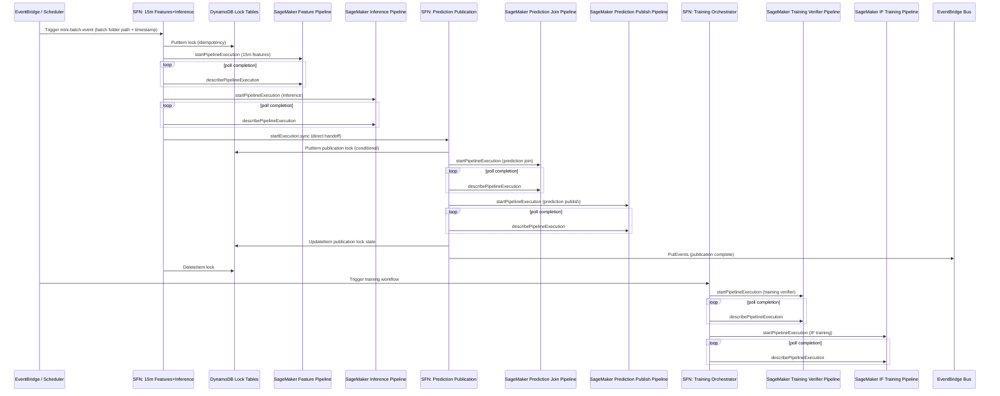

# Orchestration and Event Lifecycle

This diagram focuses on control flow and pipeline-driven completion patterns across the five state machines.

## Why this view helps

- Clarifies where idempotency and duplicate suppression are enforced.
- Shows callback-lambda removal and polling-based completion control.
- Makes direct 15m-to-publication handoff explicit.
