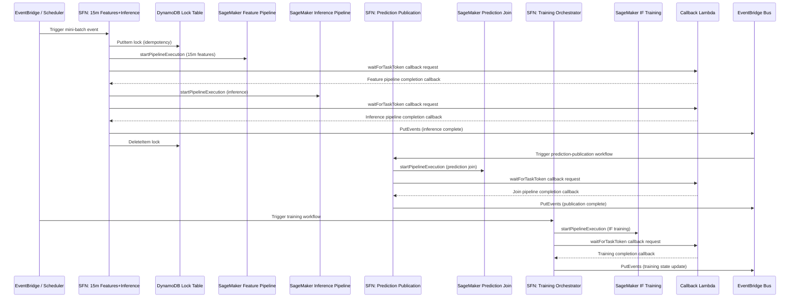

# Orchestration and Event Lifecycle

This diagram focuses on control flow, callbacks, and event publication patterns across the five state machines.

## Why this view helps

- Clarifies where idempotency is enforced.
- Shows asynchronous callback boundaries.
- Makes event-driven handoffs explicit for technical and non-technical stakeholders.
