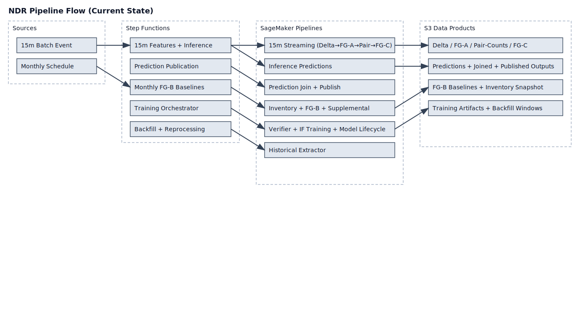
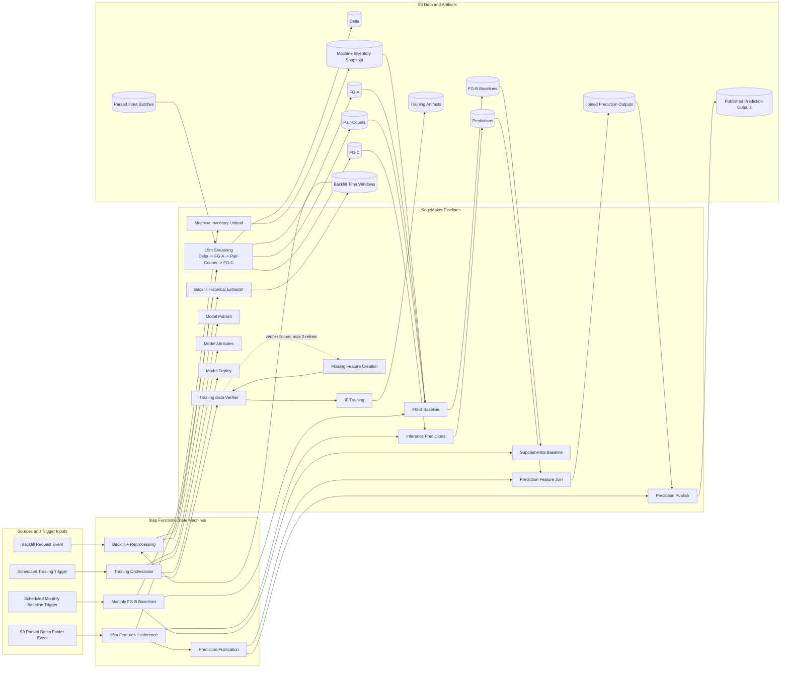

# NDR Pipeline Flow Diagram

## Notes

- Reflects the current five-state-machine orchestration inventory: 15-minute, monthly baselines, training, prediction publication, and backfill/reprocessing.
- Includes replacement pipeline-native stages now represented in orchestration definitions: training verifier/remediation and model publish/attributes/deploy; monthly baselines now complete after canonical FG-B publication without a supplemental placeholder pipeline.
- Shows that prediction publication runs as a separate state machine started synchronously by the 15-minute workflow.
