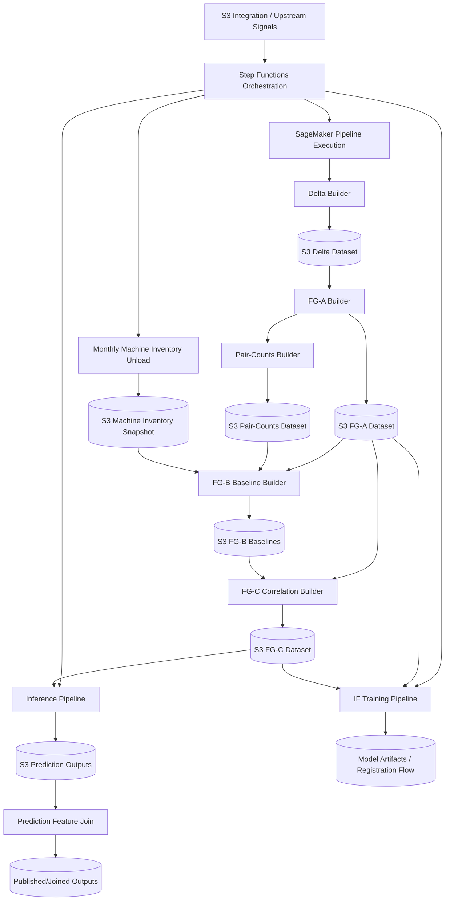

# NDR Pipeline Flow Diagram

## Notes

- This diagram is conceptual and reflects the repository's current processing components and orchestration roles.
- Runtime parameters are passed by Step Functions/SageMaker pipeline invocations; structural config is loaded by jobs from JobSpec/config sources.
