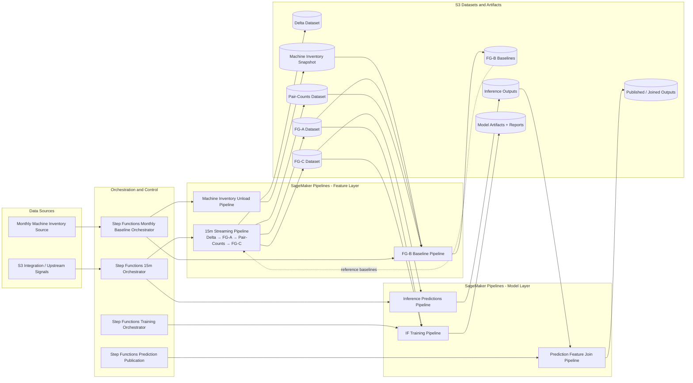

# NDR Pipeline Flow Diagram

## Notes

- Updated to align with current pipeline modules: the 15-minute streaming pipeline includes **FG-C** (`build_15m_streaming_pipeline`), while **FG-B baselines** remain in a separate monthly pipeline.
- Inference, training, and prediction-publication are represented as distinct SageMaker pipelines started by dedicated Step Functions state machines.
- The diagram emphasizes that FG-B outputs are used as reference data for FG-C computations in subsequent 15-minute runs.
