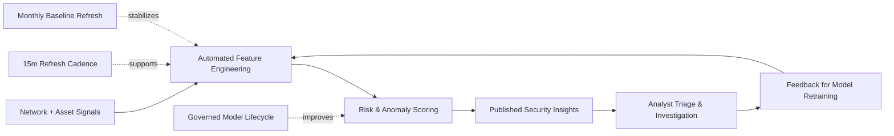

# Stakeholder Value Flow (Business-Friendly)

A simplified view of how data is transformed into operational outcomes.

## Intended audience

- Security program managers
- Data/ML product owners
- Platform stakeholders who need outcomes without low-level service details
