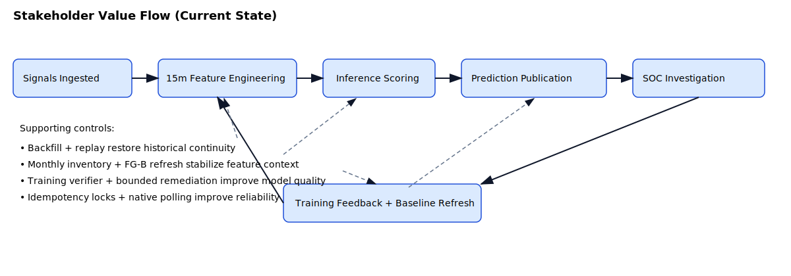
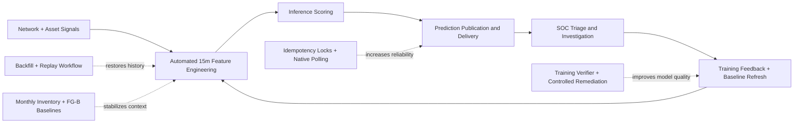

# Stakeholder Value Flow (Business-Friendly)

A simplified, current-state view of how operational signals become analyst-ready outcomes and model improvements.

## Intended audience

- Security program managers
- Data/ML product owners
- Platform stakeholders who need outcomes without low-level service details
