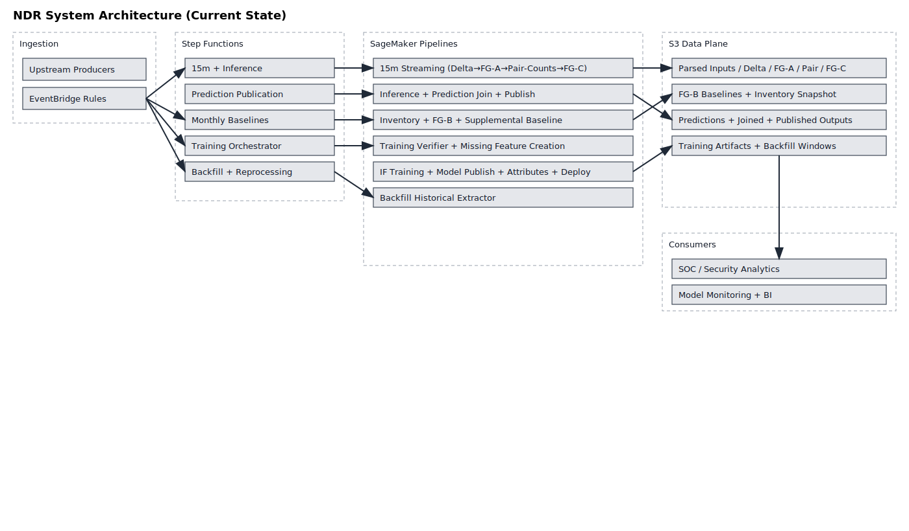
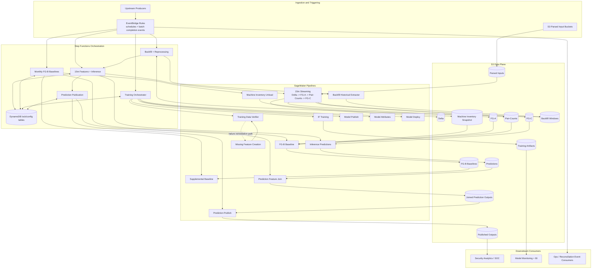

# NDR System Architecture (Complete View)

This diagram provides a current-state view across orchestration, processing, storage, configuration, and downstream consumption.

## Scope notes

- Focuses on implemented repository architecture: EventBridge + Step Functions + SageMaker pipelines + DynamoDB lock/config + S3 data products.
- Reflects pipeline-native replacements in orchestration (supplemental baseline, training verifier/remediation, and model lifecycle stages).
- Omits speculative optional services to keep this view aligned with active definitions.
